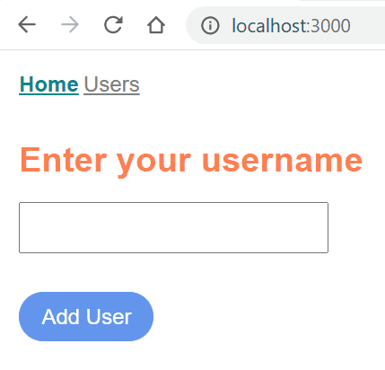

# Basics of Node.js

A simple example web app written with Node.js without using other frameworks like [Express.js](https://expressjs.com/).

## Run App

* Install dependency packages with `npm install`.

* Run `node app.js` and open the web app at `localhost:3000`. While developing the app, we can also run `npm start` - this will automatically restart the app whenever new changes are added to the source code.

