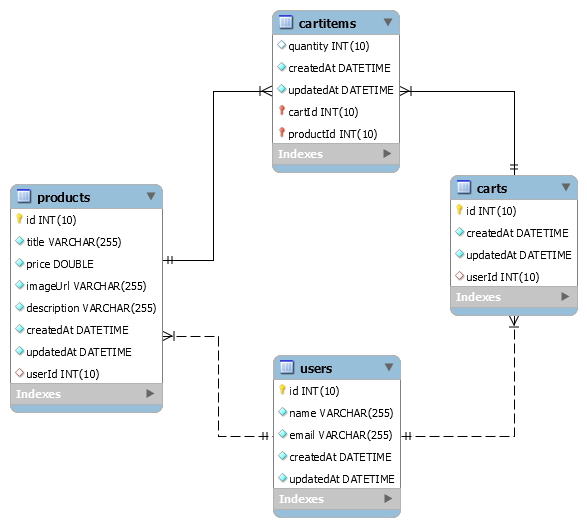

# Online Shop

[](https://nodejs.org/)
[](https://expressjs.com/)
[](https://mit-license.org/)

Create an online shopping website with [Node.js](https://nodejs.org/) and [Express.js](https://expressjs.com/).

## 3rd-Party Packages

The app uses the following 3rd-party packages

| Package | Type | Purpose |
|---------|------|---------|
| [express](https://www.npmjs.com/package/express) | `production` | Provide a web framework while using Node.js |
| [body-parser](https://www.npmjs.com/package/body-parser) | `production` | Parse incoming request bodies in a middleware before the request handlers |
| [nodemon](https://www.npmjs.com/package/nodemon) | `dev` | Auto reload app when making any changes to source code |
| [ejs](https://www.npmjs.com/package/ejs) | `production` | `Template Engine` [`Homepage`](https://ejs.co/) Generate HTML markup dynamically |
| [pug](https://www.npmjs.com/package/pug) | `production` | `Template Engine` [`Homepage`](https://pugjs.org/) Render HTML templates dynamically |
| [express-handlebars](https://www.npmjs.com/package/express-handlebars) | `production` | `Template Engine` Precompile HTML templates on server side for [Express.js](https://expressjs.com/) apps |
| [mysql2](https://www.npmjs.com/package/mysql2) | `production` | Connect to and run SQL queries against [`MySQL`](https://www.mysql.com/) databases. _Note that, [mysql](https://www.npmjs.com/package/mysql) also provides adequate functionalities to work with *MySQL* databases._ See [online_shopping_database.sql](./databases/online_shopping_database.sql) for instructions on how to prepare a MySQL database. |
| [sequelize](https://www.npmjs.com/package/sequelize) | `production` | [`Homepage`](https://sequelize.org/) Map information between objects (JavaScript objects in Node.js) and relational databases (MySQL in this project) - usually refered as `ORM` - [_Object Relational Mapping_](https://en.wikipedia.org/wiki/Object-relational_mapping). `sequelize` requires [mysql2](https://www.npmjs.com/package/mysql2) to be installed in order to work with MySQL databases. |
| [mongodb](https://www.npmjs.com/package/mongodb) | `production` | A [MongoDB Node.js driver](https://github.com/mongodb/node-mongodb-native) allowing Node.js app to connect to [MongoDB](https://www.mongodb.com/) databases. This project will use cloud-based [MongoDB Atlas](https://www.mongodb.com/cloud/atlas) as a NoSQL backend database. |
| [mongoose](https://www.npmjs.com/package/mongoose) | `production` | [`Homepage`](https://mongoosejs.com/) Model app data and handle boilerplate queries and logic code when working with [MongoDB](https://www.mongodb.com/) - usually refered as `ODM` _Object Document Modeling_. |
| [express-session](https://www.npmjs.com/package/express-session) | `production` | Create and manage sessions and cookies |
| [connect-mongodb-session](https://www.npmjs.com/package/connect-mongodb-session) | `production` | Lightweight MongoDB-based session store that will be used to store user sessions in a MongoDB database |
| [bcryptjs](https://www.npmjs.com/package/bcryptjs) | `production` | Hash passwords using the widely supported [bcrypt](https://en.wikipedia.org/wiki/Bcrypt) algorithm |
| [csurf](https://www.npmjs.com/package/csurf) | `production` | Provide [CSRF](https://en.wikipedia.org/wiki/Cross-site_request_forgery) protection for Node.js app |
| [connect-flash](https://www.npmjs.com/package/connect-flash) | `production` | Store/retrieve messages in/from _flash_ area of _session_ - the _flash_ used in combination with _redirects_ ensuring that the message is available to the next page that is to be rendered |
| [nodemailer](https://www.npmjs.com/package/nodemailer) | `production` | [`Homepage`](https://nodemailer.com/) Send emails from Node.js apps |
| [nodemailer-sendgrid-transport](https://www.npmjs.com/package/nodemailer-sendgrid-transport) | `production` | Work in combination with [nodemailer](https://www.npmjs.com/package/nodemailer) to send emails through [SendGrid's Web API](https://sendgrid.com/docs/API_Reference/Web_API/mail.html) |
| [@sendgrid/mail](https://www.npmjs.com/package/@sendgrid/mail) | `production` | [`@sendgrid/mail's Github repo`](https://github.com/sendgrid/sendgrid-nodejs/tree/main/packages/mail) Send emails from Node.js apps through [SendGrid v3 API](https://sendgrid.com/docs/API_Reference/api_v3.html) |
| [express-validator](https://www.npmjs.com/package/express-validator) | `production` | [`Homepage`](https://express-validator.github.io/) Validate and sanitize user inputs |

## Source Code

Switch the source code to versions described below to view different implementations.

| Git Tag | Implementation |
|---------|----------------|
| [online-shop/save-data-in-files](https://github.com/TranXuanHoang/NodeJS/releases/tag/online-shop%2Fsave-data-in-files) | Saving app data in files |
| [v2.0.0](https://github.com/TranXuanHoang/NodeJS/releases/tag/v2.0.0) | Saving app data in a SQL database ([MySQL](https://www.mysql.com/)) |
| [v3.0.0](https://github.com/TranXuanHoang/NodeJS/releases/tag/v3.0.0) | Saving app data in a NoSQL database ([MongoDB](https://www.mongodb.com/)) and using [MongoDB Driver](https://github.com/mongodb/node-mongodb-native) to connect and interact with the database |
| [v4.0.0](https://github.com/TranXuanHoang/NodeJS/releases/tag/v4.0.0) | Saving app data in a NoSQL [MongoDB](https://www.mongodb.com/) while using [Mongoose](https://mongoosejs.com/) to avoid boilerplate code when just using [MongoDB Driver](https://github.com/mongodb/node-mongodb-native) |
| [v5.0.0](https://github.com/TranXuanHoang/NodeJS/releases/tag/v5.0.0) | Adding user authentication, user authorization and form inputs validation |

## SQL Database Model

During the first launch, [sequelize](https://www.npmjs.com/package/sequelize) will automatically create tables and their relationships depicted as the following EER diagram. Run [online_shopping_database.sql](./databases/online_shopping_database.sql) to _manually create the database and its tables and relationships_.



## Example of NoSQL Data Model

Below is an example of collections and documents representing the app data released under [v4.0.0](https://github.com/TranXuanHoang/NodeJS/releases/tag/v4.0.0):

```json
// Users collection
{
  "_id": "5f3f350a5394a02da09c6139",
  "name": "Hoang",
  "email": "test@mail.com",
  "cart": {
    "items": [
      {
        "_id": "5f3ff05766de5a5c74bd87e1",
        "productId": "5f3f3deb43a8e554ac7c8b93",
        "quantity": 2
      },
      {
        "_id": "5f3ff05d66de5a5c74bd87e2",
        "productId": "5f3f89e8fbdf8967908535a9",
        "quantity": 1
      }
    ]
  }
}
```

```json
// Products collection
[
  {
    "_id": "5f3f3deb43a8e554ac7c8b93",
    "title": "A Book",
    "price": 19.5,
    "description": "A great book",
    "imageUrl": "https://cdn.pixabay.com/photo/2016/03/31/20/51/book-1296045_960_720.png",
    "userId": "5f3f350a5394a02da09c6139"
  },
  {
    "_id": "5f3f89e8fbdf8967908535a9",
    "title": "Car",
    "price": 6010,
    "description": "A new generation of engine with high speed!",
    "imageUrl": "https://img.icons8.com/plasticine/2x/car.png",
    "userId": "5f3f350a5394a02da09c6139"
  }
]
```

```json
// Orders collection
[
  {
    "user": {
      "name": "Hoang",
      "userId": "5f3f350a5394a02da09c6139"
    },
    "products": [
      {
        "_id": "5f3fe5115fee2d668ca61495",
        "quantity": 1,
        "product": {
          "_id": "5f3f89e8fbdf8967908535a9",
          "title": "Car",
          "price": 6010,
          "description": "A new generation of engine with high speed!",
          "imageUrl": "https://img.icons8.com/plasticine/2x/car.png",
          "userId": "5f3f350a5394a02da09c6139"
        }
      }
    ],
    "createdAt": "2020-08-21T15:15:29.373Z"
  }
]
```
