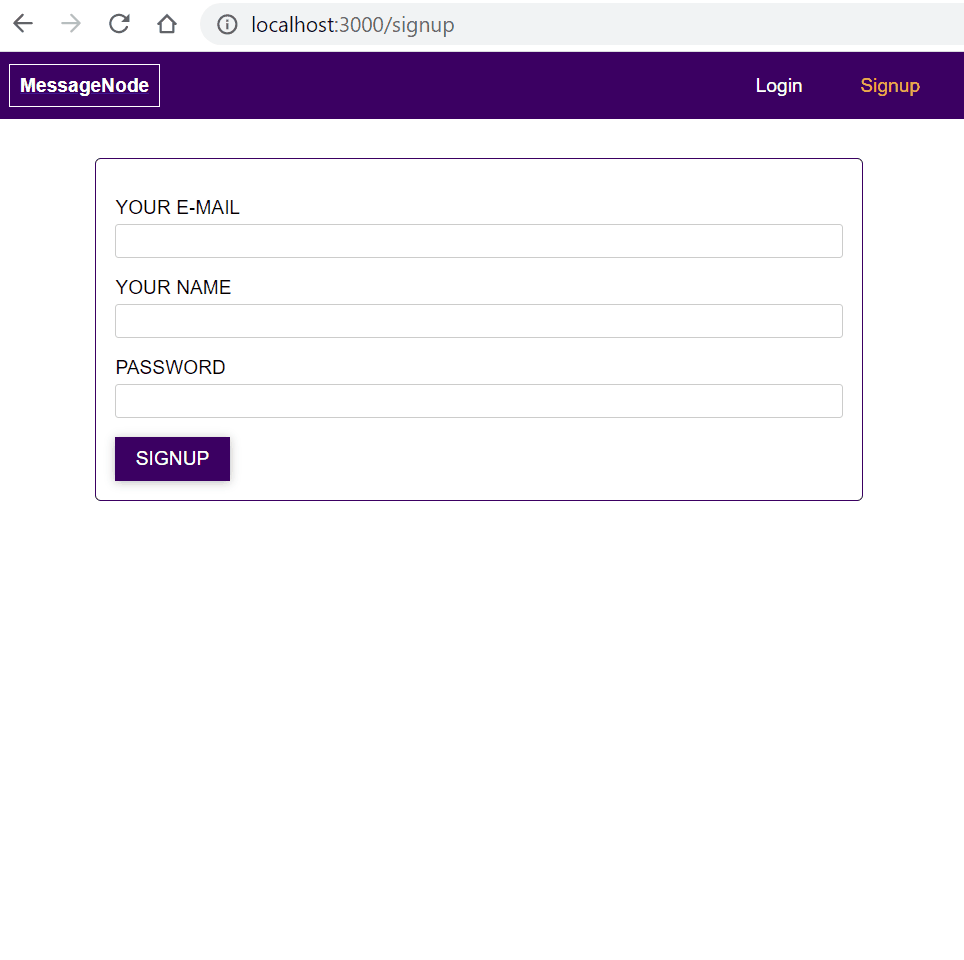

# Posts Sharing

[](https://nodejs.org/)
[](https://expressjs.com/)
[](https://reactjs.org/)

Create a web application allowing users to share posts

<p align="center">
  
</p>

The app is constituted from

* a [backend](./backend) app (written in Node.js) that provides `RESTful` APIs serving data and authentication/authorization.
* and a [frontend](./frontend) app (written in [`React`](https://reactjs.org/)) that is the UI for users to interact with.

## Source Code

Switch the source code to versions described below to view different implementations.

| Git Tag | Implementation |
|---------|----------------|
| [v8.0.0](https://github.com/TranXuanHoang/NodeJS/releases/tag/v8.0.0) | Creating posts sharing app |
| [v8.1.0](https://github.com/TranXuanHoang/NodeJS/releases/tag/v8.1.0) | Synchronizing posts adding, updating and deleting across online users |
| [v8.2.0](https://github.com/TranXuanHoang/NodeJS/releases/tag/v8.2.0) | Change from using `REST` to using `GraphQL` APIs |

## GraphQL APIs

In [v8.2.0](https://github.com/TranXuanHoang/NodeJS/releases/tag/v8.2.0), the app uses [`GraphQL`](https://graphql.org/) to exchange data between the [backend](./backend) and [frontend](./frontend). Below is a list of GraphQL queries the app supports in [v8.2.0](https://github.com/TranXuanHoang/NodeJS/releases/tag/v8.2.0).

```javascript
// Signup a new user
mutation {
  createUser(userInput: {email: "...", name: "...", password: "..."}) {
    _id
    name
  }
}

// Log user in
query {
  login(email: "...", password: "...") {
    token
    userId
  }
}

// Create a new post
mutation {
  createPost(postInput: {title: "...", content: "...", imageUrl: "..."}) {
    _id
    title
    content
    imageUrl
    creator {_id name}
    createdAt
    updatedAt
  }
}

// Fetch a list of posts
query {
  posts(page: ...) {
    posts {
      _id
      title
      content
      imageUrl
      creator {_id name password status posts {_id}}
      createdAt
      updatedAt
    }
    totalPosts
  }
}

// Fetch a single post
query {
  post(id: "...") {
    _id
    title
    content
    imageUrl
    creator {_id name}
    createdAt
    updatedAt
  }
}

// Update an existing post
mutation {
  updatePost(id: "...", postInput: {title: "...", content: "...", imageUrl: "..."}) {
    _id
    title
    content
    imageUrl
    creator {_id name}
    createdAt
    updatedAt
  }
}

// Delete an existing post
mutation {
  deletePost(id: "...")
}

// Retrieve user information (used in showing user status)
query {
  user {
    _id
    name
    email
    status
    posts {_id}
  }
}

// Update user status
mutation {
  updateStatus(status: "...") {
    status
  }
}
```
