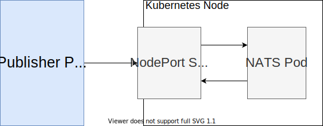

# NATS Test

This is a mini-project demonstrating how to use a [NATS](https://nats.io/) [Streaming Server](https://docs.nats.io/nats-streaming-concepts/intro) to send and receive messages.

## Command Log

```powershell
# Initialize a NodeJS project and create a TypeScript config file
npm init -y
tsc --init

# Install library packages
npm i node-nats-streaming ts-node-dev typescript @types/node
```

## NPM Scripts

There are 2 `npm scripts` that are used to run two separate processes - one for publishing messages, and one for listening for messages

```json
"scripts": {
  "publish": "ts-node-dev --rs --notify false src/publisher.ts",
  "listen": "ts-node-dev --rs --notify false src/listener.ts"
},
```

The `ts-node-dev` library recently released a change that by default disables typing the characters `rs` at the terminal to restart the `ts-node-dev` instance. To enable this behaviour, `--rs` is added to each above script.

## Make NATS Streaming Server Port Accessible

The `NATS Streaming Server` is setup to run inside a K8s pod (see [nats-depl.yaml](../infra/k8s/nats-depl.yaml)). In order to allow our [publisher](./src/publisher.ts) and [listener](./src/listener.ts) that run locally outside of the K8s cluster to connect to the `NATS Streaming Server`, we might have at least 3 ways:

- Create a K8s ClusterIP service

  

- Create a K8s NodePort service

  

- Forward Port

  

For our simple NATS demonstration purpose of this `NATS Test` app, option 3 (`Forward Port`) above is used. Below are commands for making such port-forwarding structure:

```powershell
# Find NATS Streaming Server K8s Pod
$ kubectl get pods
NAME                                  READY   STATUS    RESTARTS   AGE
auth-depl-58564cb4d8-x94gq            1/1     Running   0          56m
auth-mongo-depl-5bc9c45b44-xxcxw      1/1     Running   0          56m
client-depl-65686597ff-r76bf          1/1     Running   0          56m
nats-depl-5ff5fff9b-ccmzl             1/1     Running   0          56m   # This is the Pod we want to forward port
tickets-depl-58b89d7c98-g52lx         1/1     Running   0          56m
tickets-mongo-depl-5c7c6746f8-5nc9b   1/1     Running   0          56m

# Tell K8s to forward port 4222 (for connection) and 8222 (for monitoring)
$ kubectl port-forward <NATS_POD_NAME> <LOCAL_MACHINE_PORT>:<K8S_POD_ACTUAL_PORT>
# In this example here, we can run the following command to forward port 4222
# on local machine to port 4222 of the K8s pod that running NATS Streaming Server
#   $ kubectl port-forward nats-depl-5ff5fff9b-ccmzl 4222:4222
#   Forwarding from 127.0.0.1:4222 -> 4222
#   Forwarding from [::1]:4222 -> 4222
#
# In the same way, we can run the following command to forward port 8222
#   $ kubectl port-forward nats-depl-5ff5fff9b-ccmzl 8222:8222
#   Forwarding from 127.0.0.1:8222 -> 8222
#   Forwarding from [::1]:8222 -> 8222

# Open the following URL to see the NATS monitoring webpage
http://localhost:8222/streaming

# Open the first channel subscribed in NATS Streaming Server with the link below
http://localhost:8222/streaming/channelsz?subs=1
```
